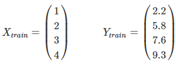

### 회귀 (Regression)
- 데이터가 평균과 같은 일정한 값으로 돌아가려는 경향을 이용한 통계학 기법이다.
- 여러 개의 독립 변수와 한 개의 종속 변수 간의 상관관계를 모델링하는 기법을 통칭한다.
- feature와 target 데이터 기반으로 학습하여 최적의 회귀 계수(W)를 찾는 것이 회귀의 목적이다.
- 아래는 복습 시간에 따른 다음 수업의 이해도를 수치로 표현한 표이다.

---

    <table style="margin-left: 20px; text-align: center; border: 1px solid #eee; width: 500px;">
        <tr>
            <th>복습 시간 (x)</th>
            <th>다음 수업의 이해도 (y)</th>
        </tr>
        <tr>
            <td>1</td>
            <td>2.2</td>
        </tr>
        <tr>
            <td>2</td>
            <td>5.8</td>
        </tr>
        <tr>
            <td>3</td>
            <td>7.6</td>
        </tr>
        <tr>
            <td>4</td>
            <td>9.3</td>
        </tr>
    </table>  
    

        
    

  

---

- 5시간 복습을 했을 때, 다음 수업의 이해도를 예측하고자 한다면,  
학습 데이터(x)를 가장 잘 표현할 수 있는 직선을 찾아야 하고, 이 식을 가설(Hypothesis)라고 한다.
- 아래는 위 데이터를 표현하고자 하는 직선의 방정식과 가설이다.
- 수학에서 W는 기울기, b는 절편이지만, 가설에서 W(Weight) 가중치, b(bias)를 편향이라 한다. 편향은 다양한 요인을 대표하는 값이다.

- 위 3개의 직선 중에서 데이터를 가장 잘 표현한 직선을 고르고자 한다면, 오차(error)를 구해봐야 한다.

<table style="margin-left: 20px; text-align: center; border: 1px solid red; width: 700px; margin-bottom: 50px;">
    <caption style="font-weight: bold">H(x) = 2x + 1</caption>
    <tr>
        <th>X</th>
        <th>1</th>
        <th>2</th>
        <th>3</th>
        <th>4</th>
    </tr>
    <tr>
        <td>Y</td>
        <td>2.2</td>
        <td>5.8</td>
        <td>7.6</td>
        <td>9.3</td>
    </tr>
    <tr>
        <td>H(x)</td>
        <td>3</td>
        <td>5</td>
        <td>7</td>
        <td>9</td>
    </tr>
    <tr style="font-weight: bold">
        <td>E</td>
        <td>-0.8</td>
        <td>0.8</td>
        <td>0.6</td>
        <td>0.3</td>
    </tr>
</table>

<table style="margin-left: 20px; text-align: center; border: 1px solid blue; width: 700px; margin-bottom: 50px;">
    <caption style="font-weight: bold">H(x) = 3x - 1</caption>
    <tr>
        <th>X</th>
        <th>1</th>
        <th>2</th>
        <th>3</th>
        <th>4</th>
    </tr>
    <tr>
        <td>Y</td>
        <td>2.2</td>
        <td>5.8</td>
        <td>7.6</td>
        <td>9.3</td>
    </tr>
    <tr>
        <td>H(x)</td>
        <td>2</td>
        <td>5</td>
        <td>8</td>
        <td>11</td>
    </tr>
    <tr style="font-weight: bold">
        <td>E</td>
        <td>0.2</td>
        <td>0.8</td>
        <td>-0.4</td>
        <td>-1.7</td>
    </tr>
</table>

<table style="margin-left: 20px; text-align: center; border: 1px solid green; width: 700px;">
    <caption style="font-weight: bold">H(x) = 6.5</caption>
    <tr>
        <th>X</th>
        <th>1</th>
        <th>2</th>
        <th>3</th>
        <th>4</th>
    </tr>
    <tr>
        <td>Y</td>
        <td>2.2</td>
        <td>5.8</td>
        <td>7.6</td>
        <td>9.3</td>
    </tr>
    <tr>
        <td>H(x)</td>
        <td>6.5</td>
        <td>6.5</td>
        <td>6.5</td>
        <td>6.5</td>
    </tr>
    <tr style="font-weight: bold">
        <td>E</td>
        <td>-4.3</td>
        <td>-0.7</td>
        <td>1.1</td>
        <td>2.8</td>
    </tr>
</table>

---  

- E = Y - H(x)로 계산하면 E가 음수로 나올 수 있기 때문에 전체 오차의 크기를 측정할 수 없다.
- 따라서 **각 제곱을 한 뒤 더하고 평균**을 구한다.
- 이를 **"평균 제곱 오차(MSE)"** 라고 한다.

### 최적화(Optimizer) - 경사 하강법(Gradient Descent)  
아래의 설명부터는 이해를 위해 W를 가중치가 아닌 기울기로, bias를 절편, 0으로 가정한다.  

- 손실 함수의 값을 최소로 하는 기울기와 절편을 찾기 위해서 최적화(Optimization) 알고리즘이 사용된다.
- 기울기(W)와 오차의 관계를 그래프로 나타내기 위해서는 패턴을 알아야 한다. 그 패턴은 다음과 같다.
- 기울기(W)가 지나치게 크면 오차도 커지고, 지나치게 작아도 오차가 커지기 때문에 적절한 기울기를 찾아야 한다.

### Mini batch
- 기존에 사용했던 전체 데이터를 대상으로 한 번에 경사 하강법을 수행하는 방법은 '배치 경사 하강법'이라 한다.
- 배치 경사 하강법은 전체 데이터를 사용하므로 W가 최적값에 수렴하는 과정이 안정적이다.
- 하지만 시간이 너무 오래 걸리기 때문에, 나누어서 하는 방법이 필요하고 이를 '미니 배치 경사 하강법'이라 한다.
- 미니 배치 경사 하강법은 미니 배치 단위로 경사 하강법을 수행하는 방법이다.
- 전체가 아닌 일부 데이터를 사용하기 때문에 W가 최적값에 수렴하기 위해 많이 헤맬 수 있다.
- 하지만 상대적으로 훈련 속도가 빨라서 시간적 효율이 높다.

### Decision Tree Regression (회귀 트리)
- 결정 트리와 결정 트리 기반의 앙상블 알고리즘은 분류뿐 아니라 회귀분석도 가능하다.
- 분류와 유사하게 분할하며, 최종 분할 후 각 분할 영역에서 실제 데이터까지의 거리들의 평균 값으로 학습 및 예측을 수행한다.
- 회귀 트리 역시 복잡한 트리 구조를 가질 경우 과적합의 위험이 있고, 트리 크기와 노드의 개수 제한등으로 개선해야 한다.
- 독립 변수들과 종속 변수 사이의 관계가 상당히 비선형적일 경우 사용하는 것이 좋다.
